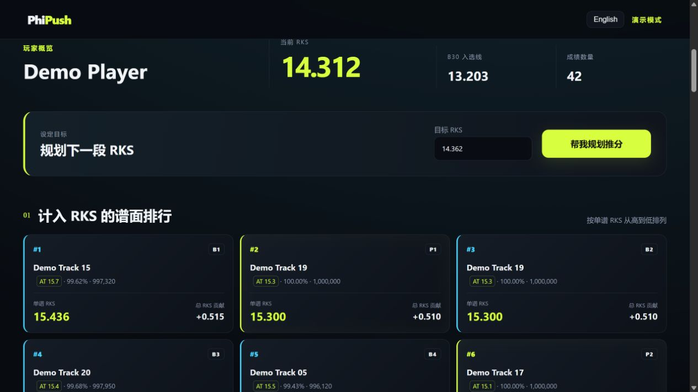

# PhiPush

> What should I grind next?

PhiPush 是一个面向 Phigros 玩家的 RKS 推分规划工具。它读取玩家本人授权的成绩后，不只展示 B30，还会模拟不同谱面的 ACC 提升，估算其对总 RKS 的贡献，推荐下一张更值得推的谱面，并规划目标 RKS 的近似路线。

## 当前状态

✅ Web 本地版已验证<br>
✅ TapTap 真实账号登录与云存档读取已完成一次端到端验证<br>
✅ RKS / B30 / Phi 计算已与真实账号结果核对<br>
✅ 推分推荐与目标 RKS 路线<br>
🚧 微信小程序原型，尚未完成真机或正式环境验证<br>
🚧 尚未作为公共在线服务部署

> **非官方声明：** PhiPush 是非官方第三方社区项目，与 Phigros、Pigeon Games、TapTap、WeChat（微信）没有官方隶属、合作、授权或背书关系。真实登录只代表作者本人在一个账号和当时版本上的一次端到端验证，不代表所有账号或后续版本；第三方接口和协议未来可能变化。

## Demo



截图由 Mock 模式生成，仅包含仓库内的虚构玩家和虚构成绩，不含真实账号、昵称、Token、Cookie 或云存档数据。

## 核心功能

- 显示当前 RKS、P1–P3、B1–B27、入选线和全部谱面成绩
- 按 ACC、定数或单谱 RKS 搜索、筛选和排序
- 模拟多个 ACC 目标，估算 B27 与 Phi 槽的总 RKS 收益
- 输出 Top 10 推分机会及推荐理由
- 为目标 RKS 生成最多 10 步的近似路线
- 遇到未知谱面时安全降级，不因缺少定数而崩溃
- 只读访问云存档，不包含上传、改分或作弊功能

## 快速开始

如果使用 Windows，可直接从 [Releases](https://github.com/Whicho6/PhiPush/releases) 下载 `PhiPush-Windows-x64.zip`，解压后双击 `PhiPush.exe`。也可使用 GitHub 绿色 **Code → Download ZIP**：源码压缩包根目录同样包含 `PhiPush.exe`。不需要安装 Python；程序会自动打开浏览器。运行期间请保持控制台窗口开启，关闭窗口即停止本地服务。

#### Windows 显示“Windows 已保护你的电脑”

当前 EXE 没有付费代码签名，新发布且下载量较少，Microsoft Defender SmartScreen 可能将它标记为“无法识别的应用”。这是基于文件来源和应用信誉的预防性警告，不等于 Windows 已确认它是恶意软件。Windows 10 和 Windows 11 都可能出现此提示。

只有在你确认文件来自本项目时，才继续：

1. 确认下载地址是 `github.com/Whicho6/PhiPush`，不要运行第三方转发的 EXE。
2. 可先用 Windows Defender 或你的杀毒软件扫描文件。
3. 在蓝色 SmartScreen 窗口中点击 **更多信息**。
4. 再次确认应用名为 `PhiPush.exe`。未签名版本的发布者会显示为未知。
5. 点击 **仍要运行**。

如果没有“更多信息”或“仍要运行”，可右键 `PhiPush.exe` → **属性** → **常规**，查看窗口底部是否有 **解除锁定**，勾选后点击 **应用** 与 **确定**。该选项不是所有文件都会出现；仅应对已核对来源的文件使用。

Windows 11 的 Smart App Control，以及公司、学校设备的组策略 / Intune 策略，可能完全隐藏绕过选项。这种情况下不要为运行 PhiPush 而关闭 Defender、SmartScreen 或组织安全策略；请改用上方的 Python 源码方式，或联系设备管理员。微软对下载标记与管理策略的说明见 [Attachment Manager](https://support.microsoft.com/en-us/windows/security/information-about-the-attachment-manager-in-microsoft-windows)、[App & browser control](https://support.microsoft.com/en-us/windows/security/windows-security-app-browser-control-in-the-windows-security-app) 和 [SmartScreen reputation](https://learn.microsoft.com/en-us/windows/apps/package-and-deploy/smartscreen-reputation)。

当前根目录 `PhiPush.exe` 的 SHA-256 为：

```text
f07c9509f6d2bd5f72db313b77817597a2a9b248f1f406917ee0c410aaf30ddb
```

可在 PowerShell 中核对：

```powershell
Get-FileHash .\PhiPush.exe -Algorithm SHA256
```

如果使用源码，需要 Python 3.11+：

```bash
git clone <your-repository-url>
cd PhiPush
python -m venv .venv

# Windows
.venv\Scripts\activate

# macOS / Linux
source .venv/bin/activate

python -m pip install -r requirements.txt
```

### Mock 模式

```bash
python run.py --mock
```

打开 `http://127.0.0.1:8000`，点击“进入 Mock 演示”。Mock 模式使用 42 条虚构成绩，不需要 TapTap 账号、真实凭证或完整曲库。

### Real 模式

```bash
python run.py
```

首次运行需要连接 GitHub Raw。PhiPush 会从固定的公开上游提交下载初始化资源，校验 SHA-256 后，仅在用户本机生成：

- `.env`：TapTap / LeanCloud 公开客户端参数与 gameRecord 解密参数
- `data/charts.json`：本地曲库

这两个文件都被 Git 忽略，不随仓库分发。下载失败或校验不一致时，程序会拒绝使用该资源并以 degraded 状态启动。已有自己配置的用户可继续通过 [`.env.example`](.env.example) 覆盖；认证细节见 [docs/AUTH.md](docs/AUTH.md)。

### 构建 Windows EXE

```bash
python -m pip install -r requirements-build.txt
pyinstaller --clean --noconfirm PhiPush.spec
```

输出位于 `dist/PhiPush.exe`。GitHub Actions 可手动运行，也会在推送 `v*` tag 时构建可下载的 Windows artifact；正式版 ZIP 由维护者从该 artifact 发布到 Releases。

## 架构

```text
Web（已验证） ─┐
               ├─ FastAPI ─ 成绩标准化 ─ RKS Engine ─ Push Planner
小程序原型 ────┘              │
                         内存短期会话
```

Web 是当前经过实际验证的入口。`miniprogram/` 复用同一 API，但仍是未完成端到端验证的原型。完整说明与 API 列表见 [docs/ARCHITECTURE.md](docs/ARCHITECTURE.md)。

## 推分算法

PhiPush 会测试多个 ACC 增量、常用精度节点、B27 入选线和下一档两位小数显示线，并为每个候选重新计算完整的 P1–P3 + B1–B27。推荐分数大致衡量“预计总 RKS 收益 / 估算练习成本”，并对高 ACC 和 100% 目标增加惩罚。

它是 heuristic / estimate，不是全局最优解，也不保证推荐谱面在实际体感上最容易。公式、候选生成和目标路线见 [docs/ALGORITHM.md](docs/ALGORITHM.md)。

## 安全与数据

- 只访问当前用户本人明确授权后的数据
- SessionToken 仅在一次只读加载流程中短暂使用，不写入数据库、普通 JSON 或日志
- Web 使用 HttpOnly cookie 和随机短期会话；默认 15 分钟后失效，重启服务立即清空
- 不提交真实 Token、Cookie、账号标识、成绩或私人存档
- 不提供云存档上传、成绩修改或作弊功能
- Python 无法保证敏感字符串立即从进程内存物理擦除；公开部署仍需 HTTPS、日志控制、CORS 和限流

仓库只包含虚构的 `data/demo_charts.json` 与 `data/mock_player.json`。完整真实曲库不随仓库分发；首次真实模式运行时从固定公开上游在本机生成。使用者必须自行确认本地数据的使用权。更多认证与凭证处理说明见 [docs/AUTH.md](docs/AUTH.md)。

## 微信小程序状态

`miniprogram/` 是尚未发布的原型，不是当前正式支持的入口。它仍缺少：

- 正式微信小程序 AppID
- HTTPS 与微信网络域名配置
- 对 TapTap 登录全部中间状态的正确处理
- 微信开发者工具完整验收
- 真机端到端验证与发布审核

默认 `touristappid` 和 `127.0.0.1` 配置不能直接用于真机或公开环境。

## 测试

```bash
pytest
```

测试覆盖 RKS 公式与边界、P1–P3/B1–B27、cutoff、替换模拟、目标 ACC 反推、推荐排序、目标路线、未知谱面、空成绩和 Mock API 流程。

## 当前限制

- 真实登录只完成过作者本人账号的一次端到端验证，没有公开的真实存档测试夹具
- TapTap、LeanCloud 与 Phigros 云存档流程不是面向本项目承诺稳定的公共 API
- 全新克隆的首次真实模式运行依赖 GitHub Raw；网络不可用时需手动提供本地配置与曲库
- Windows EXE 未进行付费代码签名，首次启动可能触发 SmartScreen 提示
- 推荐算法没有个人练习历史、谱面体感或严格的全局最优求解
- 内存会话适合本地单进程使用，不是成熟公共服务架构
- 微信小程序尚未完成正式环境验证

## Future Work

- 获得适用于公开服务的 TapTap / Phigros 授权与应用配置
- 增加更多可校验的曲库下载镜像与版本更新流程
- 用个人历史表现改善练习成本估算
- 增加可公开的固定二进制解析回归样本
- 完成小程序登录流程、开发者工具和真机验证
- 在满足安全与合规要求后部署 HTTPS 服务

## License / Third-party notice

原创代码使用 [MIT License](LICENSE)。第三方项目、数据来源与权利边界见 [THIRD_PARTY_NOTICES.md](THIRD_PARTY_NOTICES.md)。MIT 许可证不授予任何 Phigros、Pigeon Games、TapTap、WeChat、曲名、谱面或游戏资源权利。
